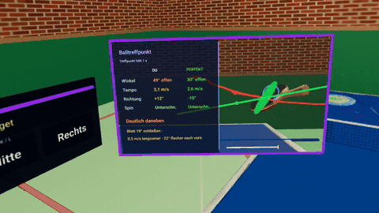

# Hackathon_26 – AI × XR Table Tennis Learning

[](https://hackathon-tt.lovable.app/__l5e/assets-v1/f3a702f2-73b1-41d3-8d54-636e078f5459/hackathon-tt-demo.mp4)

**[Demo-Video öffnen](https://hackathon-tt.lovable.app/__l5e/assets-v1/f3a702f2-73b1-41d3-8d54-636e078f5459/hackathon-tt-demo.mp4)** · [Anwendung öffnen](https://hackathon-tt.lovable.app/)

## Idee

Ein interaktiver Lernmoment für Meta Quest 3: Einen Ball mit **Unterschnitt zurückspielen** und dabei unmittelbar sehen, wie ankommender Spin, Schlägerwinkel und Schwung den neuen Spin und die Flugbahn verändern. Im Mittelpunkt steht nicht ein vollständiges Tischtennisspiel, sondern das Verstehen und bewusste Anpassen eines Schlags. Eine Desktop-Ansicht ermöglicht das Ausprobieren ohne VR-Brille.

## Funktionen

### Übung und Steuerung

- **Drei Zuspielvarianten:** Unterschnitt, Oberschnitt und Seitschnitt. Zu Unterschnitt wird ein Schupf geübt; zu Ober- und Seitschnitt ein Topspin. Das linke Menü „Schnitt-Variante“ ändert den nächsten Ball, ohne sofort einen neuen Ball zu starten.
- **Ball auf Knopfdruck:** Nach einem Versuch läuft keine automatische Ballserie. Der nächste Ball verwendet die gewählte Schnitt-Variante.
- **Schläger in der rechten Hand:** Die Haltung und Bewegung des rechten Controllers bestimmen Blattwinkel, Treffpunkt und Schwung. Die Reichweite ist begrenzt; der Desktop-Ersatz nutzt Maus und Tastatur.
- **Verschiebbares Ziel:** Im linken „Target“-Menü lässt sich das Ziel auf der gegnerischen Tischhälfte links, mittig oder rechts platzieren. Treffer auf Bullseye **oder Außenring** lösen Aufleuchten, Konfetti und einen kurzen Signalton aus.

### Ball und Physik

- **Sichtbarer Spin:** Ein Muster auf dem Ball macht die Drehung erkennbar; ein Text über dem Ball benennt Unterschnitt, Oberschnitt oder Seitschnitt. Der ankommende Unterschnitt bleibt auch nach dem Tischabsprung sichtbar.
- **Positionsabhängige Zeitlupe:** Der Ball wird auf dem Weg zum Schläger langsamer; unmittelbar nach Kontakt folgt eine kurze Beinahe-Standbildphase, dann kehrt das Tempo weich zurück. Seine Farbe verläuft entsprechend dem aktuellen Zeitfaktor von Weiß zu Orange und wieder zurück. Im Review bleibt der separat dargestellte Ball orange.
- **Flugbahn-Vorschau:** Kurz vor dem Schlag zeigt eine dezente Kurve die anhand der aktuellen Schlägerhaltung und -bewegung vorhergesagte Rückflugbahn.
- **Qualitative Ballphysik:** Schwerkraft, Luftwiderstand, Magnus-Effekt, Drall beim Tischabsprung, Netzkollision und Reibung am Schläger bestimmen die Flugbahn. Ein Durchlauf-Test erkennt Kontakte auch dann, wenn Ball und Schläger zwischen zwei Bildern aneinander vorbeilaufen. Die Physik läuft lokal im Browser und verwendet kein KI-Modell.
- **Ergebnis:** Ein Aufprall auf der gegnerischen Tischhälfte gilt als erfolgreicher Rückschlag; Netz, eigene Hälfte, Aus und Verfehlen werden getrennt erkannt. Die gegnerische Tischhälfte signalisiert einen erfolgreichen Rückschlag grün. Das Netz selbst bleibt schwarz.

### Review und Lernfeedback

- **Seitliches Live-Bild:** Eine zusätzliche Ansicht zeigt Ball, Schläger, Spin-Pfeil und Schwungrichtung aus der Nähe.
- **Schlag-Replay:** Nach einem Treffer läuft die aufgezeichnete Bewegung von Ball und Schläger in einer Schleife, mit einer Sekunde Pause am Balltreffpunkt, bis der nächste Ball gestartet wird. Die eigene Bewegung ist **rot**, die ideale Bewegung **grün**; beide Spuren sind in der Turnhalle zu sehen. Controller-Zeigestahlen und Bodenmarkierungen werden nur in der Replay-Aufnahme ausgeblendet.
- **Vergleich statt pauschalem Lob:** Die Tabelle stellt „Du“ und „Perfekt“ bei Blattwinkel, Tempo, Richtung und nach dem Schlag auch Spin gegenüber. Das Gesamturteil berücksichtigt die schlechteste Einzelabweichung; kurze Hinweise benennen konkrete Änderungen. Die Idealwerte werden für den Treffpunkt mit derselben Physik gesucht; das Feedback ist derzeit **regelbasiert**, nicht von einem Sprachmodell erzeugt.

### Umgebung

- Helle Turnhalle mit grünem Boden, roten Hallenmarkierungen, zweifarbigen Wänden, Holzbalken und Deckenbeleuchtung.
- Austauschbare 3D-Modelle für Tisch, Schläger und Ziel. Die Trefferberechnung bleibt von deren Aussehen getrennt.
- Leichtes schwarzes Netz aus einer Texturfläche statt eines komplexen 3D-Netzmodells, mit weißer Oberkante und schwarzen Pfosten. Die Netzkollision wird unabhängig davon berechnet.

## Bedienung

### Meta Quest 3

1. Die [Anwendung](https://hackathon-tt.lovable.app/) im Meta-Browser über HTTPS öffnen und **„VR starten“** wählen.
2. Den Schläger mit dem **rechten Controller** bewegen und neigen. Mit dem **rechten Trigger** den nächsten Ball starten.
3. Für die beiden Menüs nach links schauen und die gewünschte Schnitt-Variante beziehungsweise Zielposition auswählen. Die Einstellungen gelten ab dem nächsten Ball; ein Schnittwechsel startet keinen Ball.

Die Steuerung ist auf Controller ausgelegt, nicht auf Handtracking. Ein Praxistest auf einer echten Quest 3 steht noch aus.

### Desktop

| Aktion | Eingabe |
| --- | --- |
| Schläger bewegen | Maus |
| Schläger neigen | Mausrad oder `W` / `S` |
| Nächster Ball | Leertaste |
| Unterschnitt / Oberschnitt / Seitschnitt | `1` / `2` / `3` |
| Target links / Mitte / rechts | `J` / `K` / `L` |

## Lokal starten

Voraussetzung: Node.js und Bun. Im Projektverzeichnis:

```bash
bun install
bun run dev
```

Die angezeigte lokale Adresse im Browser öffnen. Für WebXR auf der Quest ist eine **HTTPS-Adresse** erforderlich; `localhost` auf dem Entwicklungsrechner ist dafür nicht die Quest-Adresse. Ein veröffentlichter Stand ist unter [hackathon-tt.lovable.app](https://hackathon-tt.lovable.app/) erreichbar.

## Technik und Grenzen

React 19, TanStack Start, Three.js, React Three Fiber und `@react-three/xr` zeichnen die WebXR-Szene. Simulation, Vorhersage und Coaching-Regeln laufen clientseitig; es gibt weder Backend noch Benutzerkonten. Das Projekt ist ein Lernprototyp, kein wissenschaftlich exakter Ballflug-Simulator und kein Match mit Gegner, Punkten oder Mehrspielerbetrieb. Die tatsächliche Darstellung und Interaktion auf einer Meta Quest 3 muss noch am Gerät geprüft werden.
